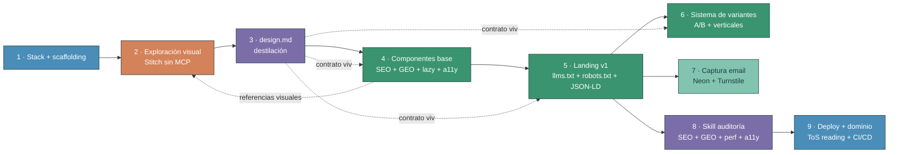

# L16 · Plan · Landing de Tendr con design system iterable

> Documento de trabajo. Define **qué** se construye en L16 y **por qué**. Para el razonamiento crítico que llevó aquí, ver `debate.md`. Para preguntas abiertas, ver `preguntas.md` y `../../_compartido/tecnico/preguntas-compartidas.md`.

**Producto del caso:** la landing pública de Tendr (el producto que se construye en L17).
**Conexión con L17:** comparten identidad visual (`design.md`), pricing tiers y Skill de auditoría SEO. Ver `../../_compartido/tecnico/preguntas-compartidas.md`.

---

## 1. Qué construye el alumno

La **landing pública de venta** de Tendr. Pieza por pieza:

| Sección de la landing | Contenido |
|---|---|
| Hero | Propuesta de valor + CTA principal a waitlist |
| Cómo funciona | Tres pasos visuales del flujo del producto |
| Features | Bloques con capacidades clave del producto |
| Pricing | 3 tiers (Free / Pro €9 / Team €29 próximamente) |
| Testimonios | Placeholders con foto + cita |
| FAQ | 5 a 8 preguntas frecuentes |
| Captura de email | Form de waitlist persistido en Neon |
| Footer | Enlaces legales, contacto, redes |

Métricas técnicas objetivo:

- Lighthouse Performance ≥ 95.
- Core Web Vitals en verde (LCP, FID/INP, CLS).
- Metadata + Open Graph + JSON-LD bien construidos y validados.
- Accesibilidad AA en componentes interactivos.
- **`llms.txt` válido en root + `robots.txt` permitiendo crawlers de IA (GPTBot, ClaudeBot, PerplexityBot, Google-Extended).**
- **JSON-LD profundo para GEO**: Organization + SoftwareApplication + FAQPage + Product validados con Google Rich Results Test.
- Bundle inicial mínimo: componentes pesados below-the-fold cargados con `next/dynamic`.

---

## 2. Decisiones clave del caso

| Decisión | Detalle | Por qué |
|---|---|---|
| Diseño primero, código después | Fases 2 a 4: explorar visualmente, destilar a `design.md`, construir | Refleja el flujo profesional real con IA en 2026 |
| Stitch 2.0 como herramienta principal de exploración, **sin MCP** | Export HTML/Figma como referencia visual; el agente con tus Skills construye el código final | Transparencia + reproducibilidad + tu sistema gana al output enlatado de un MCP externo |
| `design.md` como contrato | Tokens, voz, escala, principios; reusado en L17 | SDD aplicado a diseño |
| Componentes base con SEO + GEO + lazy + a11y integrados | Semantic HTML, `next/dynamic`, `next/image`, JSON-LD profundo, `aria-*` | Next.js 16 hace SEO de fábrica; GEO + lazy son los diferenciadores 2026 |
| **GEO como capa de visibilidad** | `llms.txt` + `robots.txt` ajustado + JSON-LD profundo + estructura de respuesta directa | Los LLMs son ya canal de descubrimiento crítico; sin GEO el sitio queda invisible a Claude/ChatGPT/Perplexity/Google AI Overviews |
| Skill de auditoría multicapa | SEO + GEO + performance + a11y, no solo SEO | Auditoría profesional moderna cubre las tres capas de visibilidad |
| Persistencia en Neon (no Supabase) | Tabla `subscribers` con Drizzle | Evita solapar con L17 |
| Resend como extensión opcional | Solo si el alumno quiere email de confirmación | DNS es fricción |
| Hosting en Vercel Hobby | Con disclaimer sobre uso comercial | Lección sobre lectura de ToS (ver `../../_compartido/tecnico/preguntas-compartidas.md §3`) |

---

## 3. Stack final

| Capa | Herramienta | Por qué |
|---|---|---|
| Framework | Next.js 16 (App Router) | RSC + Server Actions + Metadata API |
| Estilos | Tailwind CSS + shadcn/ui | Tokens fáciles + componentes accesibles base |
| Datos | Neon (Postgres serverless) | Free tier 3GB, sin DNS, sin solape con L17 |
| ORM | Drizzle + drizzle-kit | Schema-first, migraciones, idéntico al de L17 |
| Validación | Zod | Estándar de boundaries en TS |
| Email (opcional) | Resend | 3.000 emails/mes free |
| Anti-spam | Cloudflare Turnstile | CAPTCHA gratis, sin coste |
| Hosting | Vercel Hobby | Free para uso personal, ver caveat |
| CI/CD | GitHub Actions | Free generoso |
| Auditoría | Skill propia (Lighthouse + checks) | Reutilizable en L17 |

---

## 4. Desglose de 9 fases

Caso práctico único en archivo `clase-1-caso-practico.md`. Las "fases" son secciones del guion grabable.

| # | Tipo | Fase | Foco | Artefacto que produce |
|---|---|---|---|---|
| 1 | Decisión | Decisión de stack y scaffolding | Next.js + Tailwind + shadcn + Neon. Criterio de elección. | Proyecto creado, dependencias instaladas |
| 2 | Tutorial | Exploración visual con IA | **Stitch 2.0** como principal + Bolt.new opcional. 3 a 5 direcciones. Export como referencia visual, sin MCP. | Dirección visual elegida + export final |
| 3 | Tutorial | `design.md` como destilación del sistema | Tokens, voz, escala, principios, restricciones. **Reutilizado por L17.** | `design.md` versionado |
| 4 | Tutorial | Componentes base con buenas prácticas | Semantic HTML, `next/image`, `next/font`, `next/dynamic`, Suspense, JSON-LD (SEO + GEO), accesibilidad | Biblioteca de componentes |
| 5 | Tutorial | Landing v1 a partir del `design.md` + estructura GEO-friendly | Hero, features, "cómo funciona", pricing, testimonios, FAQ con sub-queries, footer. **`llms.txt` + `robots.txt` para crawlers de IA.** | Landing renderizada con GEO base |
| 6 | Tutorial | Sistema de variantes con el spec como lock | Agente genera variantes coherentes referenciando el `design.md`. **Aterrizaje del porqué de negocio (A/B, verticales, i18n, multimarca, estacionalidad).** | Variantes A/B en repo |
| 7 | Tutorial | Captura de email | Route handler, validación Zod, Drizzle, Neon, Turnstile anti-bot. Resend opcional. | Form funcional con persistencia |
| 8 | Tutorial | Skill de auditoría SEO + GEO + rendimiento + a11y | Skill multicapa: Lighthouse + JSON-LD validation + `llms.txt`/`robots.txt` checks + axe-core. **Reutilizable en L17.** | Skill versionada |
| 9 | Tutorial | Deploy y dominio | Vercel Hobby, env vars, dominio (opcional), CI/CD básico. Disclaimer ToS. | Landing pública en producción |

---

## 5. Detalle por fase

Cada fase explicada con el mismo esquema: qué es y qué produce, por qué existe, qué aprende el alumno, conexión con fases vecinas, cómo se ve en práctica, y pitfalls a evitar.

### Mapa de flujo de las 9 fases



**Cómo se lee el mapa**: las flechas continuas son dependencias secuenciales (no puedes saltar a F4 sin F3). Las **flechas punteadas** son referencias vivas: F3 (`design.md`) alimenta como contrato a F4, F5 y F6; F2 (exploración) deja material que F4 vuelve a consultar como inspiración. F6 y F7 son paralelas tras F5; F8 audita lo construido y F9 cierra.

---

### 5.1 Fase 1 · Decisión de stack y scaffolding

**Tipo:** Decisión · **Artefacto:** proyecto creado + ADR de stack documentado.

**Qué es y qué produce.** La primera fase no escribe código de producto. Es donde el alumno justifica, ante sí mismo y ante un compañero hipotético, **por qué este stack y no otro**. Produce el proyecto creado (`pnpm create next-app` + dependencias mínimas), un breve documento de decisión en `docs/decisions/001-stack.md` (un ADR ligero) y un README inicial. El acto de escribir el ADR fuerza al alumno a articular tradeoffs.

**Por qué existe esta fase.** Las decisiones de stack son caras de revertir. Cambiar de Next.js a Astro a mitad de proyecto cuesta una semana. Cambiar de Tailwind a CSS Modules cuesta otro tanto. Si el alumno empieza sin justificar, copia el stack de un tutorial y luego no sabe defender su elección. Esta fase enseña que **pensar antes de teclear es ingeniería**, no procrastinación.

**Qué aprende el alumno.**

- Cómo comparar frameworks por criterios reales (RSC support, ecosistema, hosting target, tipos).
- Cómo documentar una decisión con tradeoffs explícitos (formato ADR).
- Cómo montar Next.js 16 + shadcn/ui + Tailwind + Drizzle limpiamente.
- Distinguir entre archivos esqueleto del framework y archivos del proyecto.

**Conexión con fases vecinas.** Alimenta todas las fases siguientes. El stack elegido aquí condiciona qué Skills/MCPs son útiles, qué patrones se usan y qué deploy aplica.

**Cómo se ve en práctica.**

1. **Setup previo de herramientas del agente** (una sola vez, antes de la fase 1):
   - Context7 MCP activo (`claude mcp add context7 --scope user -- npx -y @upstash/context7-mcp`) — imprescindible para docs actualizadas de Next.js 16. Es el único MCP imprescindible en L16.
   - `neonctl` CLI autenticado (`pnpm add -g neonctl && neonctl auth`) — para crear la BD y obtener `DATABASE_URL`. El MCP de Neon es opcional y solo se activa si el alumno quiere introspección conversacional avanzada del schema.
   - `vercel` CLI autenticado (`pnpm add -g vercel && vercel login`) — para deploys, logs y env vars. Vercel MCP queda como opcional, solo si en fase 9 hace falta debugging post-deploy intensivo.
   - Skill `sdd-explore` invocable.
2. El agente, con Context7 cargado, lista 3 frameworks candidatos (Next.js 16, Astro, Remix) con tradeoffs verificados contra docs vigentes (no contra knowledge cutoff).
3. El alumno elige uno con criterio y lo justifica en voz alta para el guion.
4. Misma operación para UI (Tailwind+shadcn / Mantine / Chakra) y para BD (Neon / Turso / Supabase). Para BD, el agente verifica capacidades del tier gratuito con WebSearch contra la doc oficial de cada proveedor (no asume conocimiento de entrenamiento).
5. Decisión documentada en `docs/decisions/001-stack.md` (ADR ligero). Se usa Skill `sdd-propose` si el alumno quiere SDD explícito desde el inicio.
6. Comandos de scaffolding:
   ```
   pnpm create next-app@latest client-landing --typescript --tailwind --app --eslint
   cd client-landing
   pnpm dlx shadcn@latest init
   pnpm add drizzle-orm @neondatabase/serverless zod
   pnpm add -D drizzle-kit
   ```
7. Crear proyecto Neon desde CLI: `neonctl projects create --name client-landing-dev`, después `neonctl connection-string --project-id <id>` para obtener `DATABASE_URL`. El alumno la mete en `.env.local`.
8. Primer commit con mensaje convencional (`chore: scaffold next16 + tailwind + shadcn + drizzle + neon`).

**Pitfalls a evitar.**

- Copiar el stack sin justificar.
- Sobreingeniería: añadir 15 dependencias antes de necesitarlas.
- Saltarse el ADR pensando "ya me acuerdo del porqué".
- No commitear pronto (mejor un commit a los 10 minutos que ninguno).

---

### 5.2 Fase 2 · Exploración visual con IA

**Tipo:** Tutorial · **Artefacto:** dirección visual elegida + carpeta `exploration/` con descartes y export final como referencia.

**Qué es y qué produce.** Antes de escribir nada del `design.md`, el alumno necesita **criterio visual**. Esta fase es la divergencia controlada. Usa **Stitch 2.0** (gratis, multi-screen, voice canvas) para generar 3 a 5 direcciones visuales distintas. Compara, descarta, elige una. El export de la dirección elegida se conserva como **referencia visual**, no como código a copiar. Produce: carpeta `exploration/` con las direcciones, nota corta del porqué de la elegida y export (HTML/CSS o screenshots) de la ganadora.

**Por qué existe esta fase.** Ningún diseñador profesional empieza por tokens abstractos. La direccionalidad visual se descubre **viendo opciones**, no escribiendo. Saltarse esta fase produce `design.md` genéricos que el agente "interpreta" como mejor puede, resultando en landings que se sienten producidas en cadena. Esta fase también enseña el concepto transversal de **divergir antes de converger**, que se repite en arquitectura técnica (M2) y en testing (M3).

**Qué aprende el alumno.**

- Cómo prompt-engineerear para generar direcciones visuales con Stitch.
- Cómo comparar objetivamente: no "me gusta más" sino "esta encaja con el público B2B junior".
- Cómo descartar opciones sin lamentarlo.
- Cómo documentar la decisión con criterio articulable.
- **Qué exportar de Stitch y qué hacer con ese export** (lo más importante de esta fase).

**Conexión con fases vecinas.** La dirección elegida es input directo de fase 3 (destilación al `design.md`). El export se reusa en fase 4 (componentes base) y fase 5 (landing v1) como referencia visual que el agente lee junto con el `design.md`.

#### Herramienta principal · Stitch 2.0

Estado verificado (mayo 2026):

| Aspecto | Detalle |
|---|---|
| Coste | Gratis |
| Capacidades | Multi-screen (hasta 5 pantallas interconectadas), voice canvas, AI-native infinite canvas |
| Inputs | Texto, voz, sketches, screenshots de referencia, imágenes |
| Outputs | HTML/CSS, Figma con Auto Layout y layers nombrados, ZIP, copy al clipboard, MCP, Google AI Studio, Antigravity IDE |

#### Alternativas verificadas si Stitch no basta

| Herramienta | Cuándo usarla | Free tier |
|---|---|---|
| **Bolt.new** | Si necesitas un bloque concreto que Stitch no resuelve bien (ej: pricing tier interactivo complejo) | 1M tokens/mes, 300K diarios |
| **Lovable** | Solo si el alumno quiere experimentar con prompt-to-app entero; **no recomendado para L16** (overkill) | 5 créditos/día |
| **Figma Make** | Si el alumno viene del mundo Figma y quiere refinar manualmente | Incluido con Figma free |

**Decisión:** **Stitch 2.0 como principal**, Bolt.new como secundario opcional. Se descarta v0 y Lovable para esta lección por foco y por simplicidad.

**Galerías de inspiración complementarias** (también para ideas de wow factor que Stitch no produce solo): 21st.dev, Aceternity UI, Magic UI, React Bits, Hover.dev. Se usan como **referencia visual** en esta fase (capturas, ideas) y se profundiza el patrón en fase 4 cuando se construyen los componentes. Documentación completa en `herramientas.md`.

#### Flujo de export · sin MCP, transparente y reproducible

**Por qué no usar el MCP de Stitch en esta lección:**

- Introduce dependencia de un servicio externo que el alumno no controla.
- Si Stitch tumba el MCP o cambia condiciones, el flujo se rompe sin remedio.
- **El alumno no ve qué pasa entre "diseño" y "código"**, lo opuesto al espíritu del programa.
- Las Skills propias (taste-skill, ui-ux-pro-max, Emil Kowalski) producen mejor resultado porque respetan TU sistema, no imponen el suyo.

**Flujo recomendado:**

```
1. Generar 3-5 direcciones en Stitch 2.0
   ↓
2. Elegir una con criterio (público, voz, producto)
   ↓
3. Export como REFERENCIA, no como código final:
   - Opción A: HTML/CSS de Stitch + screenshots de cada sección
   - Opción B: Export a Figma con Auto Layout, refinar manualmente, screenshots
   ↓
4. La referencia visual queda en exploration/dir-elegida/
   (screenshots, HTML como referencia textual, notas)
   ↓
5. El agente lee este material como contexto cuando construye
   componentes (fase 4) y la landing (fase 5)
   junto con design.md + tus Skills (taste-skill, ui-ux-pro-max, Emil)
```

**Punto clave:** el HTML/CSS de Stitch **no se copia al proyecto**. Se usa como referencia textual para que el agente entienda la intención visual. El código final lo construye el agente con tus componentes base, respetando el `design.md` y las Skills. Esto es lo que diferencia un alumno que **dirige** a un alumno que **copia**.

**Cómo se ve en práctica.**

1. Brief mental del producto en una frase: "Tendr, gestor de clientes externos para B2B junior. Voz: confiable, ágil, sin corporativismo".
2. Cinco prompts distintos a Stitch 2.0 con tonos diferentes (clean SaaS, editorial premium, brutal-minimal, etc.). Multi-screen para ver hero + pricing + features en un solo render. Voice canvas si el alumno prefiere dictado.
3. Si una sección no convence con Stitch, refinarla con Bolt.new (bloque concreto, no app entera).
4. **Inspiración complementaria desde galerías** (21st.dev, Aceternity, Magic UI, React Bits): el alumno navega 2-3 galerías buscando referencias para piezas específicas (hero wow, pricing card distintivo, FAQ accordion). Solo capturas + notas, no código.
5. **Organización de la carpeta `exploration/`:**
   ```
   exploration/
   ├── dir-1-clean-saas/
   │   ├── stitch-hero.png
   │   ├── stitch-pricing.png
   │   ├── stitch-export.html       ← referencia, NO se copia al proyecto
   │   └── notes.md                  ← qué funciona, qué no
   ├── dir-2-editorial/...
   ├── dir-3-brutal-minimal/...
   ├── galleries-references/
   │   ├── aceternity-3d-card.md     ← link + screenshot
   │   └── react-bits-text-anim.md
   └── decision.md                   ← cuál se eligió y por qué
   ```
6. **Cómo el agente "consume" esto** en fases posteriores: el alumno hace `@exploration/dir-elegida` en su prompt para que Claude lea screenshots + HTML como contexto. El HTML NO se copia a `app/`; sirve solo para que el agente entienda intención visual.
7. Decisión documentada: "dir-3 porque transmite agilidad sin caer en SaaS plano y la jerarquía visual del hero respeta la voz del producto". Nota en `exploration/decision.md` con criterios.

**Pitfalls a evitar.**

- Quedarse con la primera dirección sin compararla.
- Pedir "una landing moderna" sin contexto del producto.
- Saltar la documentación de descartes.
- Confundir "me gusta más" con criterio profesional (preguntarse: ¿encaja con el público? ¿con el producto?).
- **Copiar el HTML de Stitch al proyecto en lugar de usarlo como referencia.** El código final lo construye el agente con tus componentes y tus Skills.
- Conectar el MCP de Stitch para "automatizar" el paso a código: rompe la transparencia del flujo y crea dependencia opaca.

---

### 5.3 Fase 3 · `design.md` como destilación del sistema

**Tipo:** Tutorial · **Artefacto:** `design.md` versionado.

**Qué es y qué produce.** La dirección visual elegida en fase 2 se convierte aquí en **spec versionado**. El `design.md` es el **lock** del sistema: tokens (color, tipografía, escala, espaciado, sombras, radios), voz, principios, restricciones (negative instructions de taste-skill) y referencias visuales. Una vez escrito, el agente lo lee en cada sesión y cualquier desviación es bug, no creatividad.

**Por qué existe esta fase.** Dos motivos. **Técnico:** el agente sin spec deriva, cada sesión inventa color y type scale ligeramente distintos. **Pedagógico:** anticipa SDD para código (que se enseña formalmente en L8). El alumno experimenta de primera mano que un spec ahorra discusión y previene deriva. Aplicar SDD a diseño antes que a código es más fácil de visualizar y por eso entra antes.

**Qué aprende el alumno.**

- Cómo escribir un spec usable (ni demasiado abstracto, ni demasiado prescriptivo).
- Cómo extraer tokens de una dirección visual concreta.
- Cómo documentar principios y restricciones (qué hacer y qué no).
- Cómo se mantiene vivo un spec cuando el proyecto evoluciona.

**Conexión con fases vecinas.** Alimenta fase 4 (componentes consumen tokens), fase 6 (variantes respetan principios) y se reusa en L17 para que la app comparta identidad visual con la landing.

**Cómo se ve en práctica.** Estructura típica:

```
# Design System · Tendr

## Voz
- Confiable, ágil, sin corporativismo.
- Sin jerga corporativa. Sin frases como "leverage your synergy".

## Tokens
### Color (usando oklch para mejor degradación en mobile)
- primary: oklch(0.65 0.18 250)
- ...
### Tipografía
- display: Geist Sans
- body: Geist Sans
### Escala
- base 4pt, ratio 1.25

## Principios
- Jerarquía con peso tipográfico, no con tamaño desbordado.
- Espacio blanco generoso entre secciones.
- Motion sutil, nunca protagónico.

## Restricciones · no hacer
- No Inter (overused en SaaS).
- No glassmorphism.
- No tres columnas de features con iconos arriba.
- No gradient sobre texto.

## Referencias
- Linear (motion y restraint).
- Stripe (legibilidad).
```

**Pitfalls a evitar.**

- Spec abstracto sin valores reales ("usar colores apropiados").
- Demasiado prescriptivo (microspecs imposibles de mantener).
- Olvidar las negative instructions (las más valiosas del taste-skill).
- No versionarlo en git.

---

### 5.4 Fase 4 · Componentes base con buenas prácticas

**Tipo:** Tutorial · **Artefacto:** biblioteca de componentes en `components/`.

**Qué es y qué produce.** La capa entre el `design.md` y la landing real. El alumno no construye la landing directamente: primero construye **las piezas con las que la landing se va a montar**. Produce una librería de componentes:

```
components/
├── ui/                   ← shadcn base (Button, Input, Dialog, etc.)
├── landing/
│   ├── Hero.tsx
│   ├── Section.tsx
│   ├── Feature.tsx
│   ├── PricingCard.tsx
│   ├── TestimonialCard.tsx
│   └── FAQ.tsx
├── seo/
│   ├── JsonLd.tsx        ← inyecta structured data
│   └── metadata.ts       ← helpers de Metadata API
└── a11y/
    └── SkipLink.tsx
```

#### Galerías de componentes premium como referencia visual

Para conseguir el efecto wow característico de landings de alto presupuesto (hero con 3D, particle backgrounds, magnetic buttons, beams, microinteracciones premium), el alumno usa galerías de componentes como **fuente de inspiración**, no como copy-paste. Las galerías son verificadas y conocidas en el ecosistema, y se documentan en `herramientas.md` con sus URLs.

| Galería | Cuándo recurrir a ella |
|---|---|
| **21st.dev** | Marketplace amplio, búsqueda por componente concreto, marketing-oriented |
| **Aceternity UI** | Cuando hace falta wow visual fuerte (3D cards, particle bg, magnetic, beams, spotlight) |
| **Magic UI** | Microinteracciones y polish de detalle |
| **React Bits** | Animaciones de texto y efectos sin payload de Framer Motion |
| **Hover.dev / Lightswind UI** | Alternativas con catálogo propio cuando las anteriores no cubren el caso |

**Patrón de uso obligatorio:**

```
1. El alumno detecta una necesidad: "el hero pide algo con más fuerza visual"
   ↓
2. Busca en las galerías un componente que se acerque a la idea
   ↓
3. Lee el código (HTML/CSS/JS) como REFERENCIA, no como solución
   ↓
4. Pide al agente: "construye un componente equivalente respetando
   design.md, taste-skill y los tokens del proyecto"
   ↓
5. Agente + Skills generan código adaptado a tu sistema
   ↓
6. Validación visual: ¿captura la esencia del original sin
   romper el sistema?
```

**Por qué este patrón gana al copy-paste o al Magic MCP de 21st.dev:**

- El `design.md` manda siempre. El componente nace adaptado, no parcheado después.
- El alumno aprende a leer un componente premium y entender qué lo hace especial (no es magia: es un gradient específico, una transición concreta, un easing curve preciso).
- Los Skills propios (taste-skill filtra slop, Emil Kowalski calibra motion) producen output mejor que la versión enlatada de un MCP.
- Reproducible aunque la galería cambie o cierre.

**Magic MCP de 21st.dev queda fuera de esta lección** por las mismas razones que el MCP de Stitch (ver §5.2): dependencia opaca, output no respeta tu sistema por completo, y rompe el principio de transparencia del programa. Está documentado en `herramientas.md` como herramienta del mercado que existe.

---

"Con buenas prácticas integradas" significa que **cada componente nace con SEO, GEO, rendimiento y accesibilidad dentro, no se añaden después**.

| Práctica | Cómo se traduce a código |
|---|---|
| Semantic HTML | `<section>`, `<article>`, `<nav>`, `<header>`, `<main>`, `<footer>` |
| Image optimization | `next/image` con `priority` en hero, `sizes` correctos, `alt` descriptivo, `placeholder="blur"` cuando aporta |
| Font optimization | `next/font` con subsetting, `display: swap`, preload de la familia principal |
| Code splitting | `next/dynamic` para componentes pesados below-the-fold (testimonios, FAQ con animación, vídeos embebidos). Hero y nav nunca se lazy-loadean. |
| Suspense boundaries | `<Suspense>` envolviendo bloques que dependen de data o son client-only. `loading.tsx` por ruta para skeleton inicial |
| RSC por defecto | Server Components siempre; `'use client'` solo cuando hay interactividad (form, kanban en L17, menús desplegables) |
| Metadata API | Cada ruta exporta `metadata` o `generateMetadata` con título, descripción, OG, Twitter Card |
| JSON-LD (SEO + GEO) | `<JsonLd type="Organization">` en footer, `<JsonLd type="Product">` en pricing, `<JsonLd type="FAQPage">` en FAQ, `<JsonLd type="SoftwareApplication">` en root |
| Accesibilidad | Headings con jerarquía (un solo `<h1>` por página), focus styles visibles, `aria-label` donde el texto no basta, contraste AA, `prefers-reduced-motion` respetado |

**Por qué existe esta fase.** Tres razones operativas:

1. **Composición vs reescritura.** Si el alumno va directo a montar la landing, cada sección la escribe inline. Cuando llega a la fase 6 (variantes) tiene que duplicar y modificar. Con componentes, la variante es cambiar props o componer distinto.
2. **SEO y a11y como hábito.** Si dejas SEO para la fase 8 (auditoría), te toca refactorizar. Si lo integras aquí, el auditor solo verifica.
3. **El `design.md` necesita un puente.** El spec dice "color primario es X". La fase 4 es donde X se convierte en clase Tailwind o variable CSS real.

**Qué aprende el alumno.**

- Pensar en sistema, no en página.
- Distinguir un componente bien construido de uno mal construido.
- Aplicar SEO como decisión técnica (dónde va `<h1>`, cuándo JSON-LD de Product vs Article).
- **Aplicar GEO como decisión técnica:** qué tipos de JSON-LD favorecen citación por LLMs (FAQPage, SoftwareApplication, HowTo), cómo se estructura el contenido para que un LLM lo entienda al primer scan.
- **Aplicar rendimiento como hábito:** cuándo `next/dynamic`, cuándo Suspense, cuándo Server vs Client Component.
- Aplicar a11y como decisión técnica (focus management, aria-labels, contraste, `prefers-reduced-motion`).
- Reconocer cuándo extender shadcn y cuándo construir propio (shadcn cubre primitivas; landing-specific son propios).

**Conexión con fases vecinas.** Consume `design.md` (fase 3); alimenta landing v1 (fase 5) y variantes (fase 6).

**Cómo se ve en práctica.**

1. **Activar Skills relevantes** antes de empezar la fase:
   - `vercel-react-best-practices` (64 reglas Vercel Engineering).
   - `shadcn` (Skill oficial).
   - `taste-skill` con `DESIGN_VARIANCE 7, MOTION_INTENSITY 5, VISUAL_DENSITY 4`.
   - `ui-ux-pro-max` para UX guidelines puntuales.
   - Context7 MCP siempre activo para Next.js 16 docs.
2. **Listar componentes necesarios** según landing planificada. El agente con `sdd-explore` puede ayudar a no olvidar primitivas.
3. **shadcn primero** (vía CLI, no escribir a mano):
   ```
   pnpm dlx shadcn@latest add button input card dialog tooltip accordion
   ```
4. **Componentes landing-specific construidos uno a uno**, no en bloque:
   - Pedir al agente: "construye `Hero.tsx` consumiendo tokens de `design.md`, respetando `taste-skill` negative instructions, con semantic HTML y `<h1>` único".
   - Renderizar en `/_showcase` route (visible solo en dev).
   - Verificar visualmente y con `axe-core` (`pnpm add -D @axe-core/react`).
   - Repetir.
5. **Referencias de galerías** solo cuando hace falta wow: si el hero pide algo más fuerte, el alumno toma una idea de Aceternity o React Bits y pide al agente: "inspírate en esta referencia (link + screenshot) y construye una versión respetando nuestro design.md y los tokens existentes".
6. **`<JsonLd>` y helpers SEO/GEO:**
   - `components/seo/JsonLd.tsx` recibe props (`type`, `data`) y emite `<script type="application/ld+json">`.
   - `components/seo/metadata.ts` con helpers para `Organization`, `SoftwareApplication`, `Product`, `FAQPage`.
   - Validar JSON-LD en cada commit con Rich Results Test (manual o vía Skill SEO de fase 8).
7. **Verificación incremental por componente:** tipos OK (`pnpm tsc --noEmit`), a11y básica (`axe-core`), renderiza SSR + client.

**Pitfalls a evitar.**

- Sobreingeniería: componentes con 12 props "por si acaso".
- Tailwind soup con valores hardcoded en lugar de tokens del `design.md`.
- Accesibilidad para después.
- Saltarse el showcase: ver los componentes solo cuando ya están en la landing.

---

### 5.5 Fase 5 · Landing v1 a partir del `design.md`

**Tipo:** Tutorial · **Artefacto:** landing pública en local y en preview de Vercel + estructura GEO-friendly + `llms.txt` + `robots.txt` ajustado.

**Qué es y qué produce.** Aquí se monta la landing real componiendo los componentes de fase 4 según una estructura clara que sirve a **humanos y a LLMs**. Produce las páginas `/`, `/pricing`, `/privacy`, `/terms` (placeholder), `sitemap.ts`, `robots.ts` con permisos explícitos para crawlers de IA, `llms.txt` con descripción estructurada del producto, y copy real (no Lorem). El alumno ve el output visible por primera vez.

**Por qué existe esta fase.** Hasta ahora todo ha sido preparación (decisión, exploración, spec, componentes). Esta fase es la primera donde el alumno ve el producto cobrar forma visual. Sin ella las anteriores se sienten académicas. También es donde se aplica criterio de **copy + orden de información + estructura GEO**, distinto de la arquitectura técnica.

#### Estructura GEO-friendly · novedad 2026

Los LLMs (ChatGPT, Claude, Perplexity, Google AI Overviews) son hoy un canal de descubrimiento crítico. Cuando alguien pregunta *"qué CRM ligero hay para consultores freelance"*, queremos que **Tendr aparezca citado**. Eso requiere estructurar la landing pensando en cómo un LLM lee el sitio.

```mermaid
flowchart LR
    User([Usuario pregunta a ChatGPT/Claude/Perplexity:<br/>'¿qué CRM ligero hay para consultores?'])
    Bot["GPTBot · ClaudeBot · PerplexityBot · Google-Extended"]
    R["robots.txt<br/>permite estos user-agents"]
    L["llms.txt<br/>descripción estructurada del producto"]
    H["Heading jerarquía limpia<br/>h1 único, respuesta directa primero"]
    J["JSON-LD profundo<br/>Organization + SoftwareApplication<br/>+ FAQPage + Product"]
    F["FAQ con sub-queries reales<br/>'cuánto cuesta', 'qué lo diferencia de HubSpot'"]
    Cite([LLM cita Tendr en su respuesta])

    User --> Bot
    Bot --> R
    R --> L
    L --> H
    H --> J
    J --> F
    F --> Cite

    style Bot fill:#4A8DB8,stroke:#1C3C42,color:#fff
    style R fill:#D4825A,stroke:#1C3C42,color:#fff
    style L fill:#7B6EA8,stroke:#1C3C42,color:#fff
    style H fill:#3A9470,stroke:#1C3C42,color:#fff
    style J fill:#3A9470,stroke:#1C3C42,color:#fff
    style F fill:#3A9470,stroke:#1C3C42,color:#fff
    style Cite fill:#82C4AF,stroke:#1C3C42,color:#1C3C42
```



**Si falla cualquiera de estos pilares**, el LLM no cita el sitio. `robots.txt` que bloquea GPTBot es el error más común (algunos templates lo traen así por defecto).

Pilares aplicados en esta fase:

| Pilar | Implementación |
|---|---|
| **`llms.txt` en root** | Archivo de texto plano en `/llms.txt` que describe el sitio en lenguaje natural: qué es Tendr, secciones clave, links a cada una, audiencia objetivo, pricing. Es el "README para LLMs" |
| **`robots.txt` ajustado** | Permitir explícitamente GPTBot, ClaudeBot, PerplexityBot, Google-Extended. Sin esto los crawlers de IA pasan de largo |
| **Respuesta directa primero** | Cada sección abre con la respuesta a "qué es esto" en una frase, después el contexto. Patrón de inverted pyramid |
| **Heading jerarquía limpia** | Un solo `<h1>` por página (la propuesta del producto), `<h2>` por sección mayor, `<h3>` por subsección. Un topic por heading |
| **JSON-LD profundo** | Mínimo: `Organization` + `SoftwareApplication` + `FAQPage` + `Product`. Schema markup que el LLM lee para entender contexto |
| **Sub-queries en FAQ** | El FAQ no responde solo "qué es", responde sub-preguntas: "cuánto cuesta", "para quién es", "qué lo diferencia de HubSpot", "tiene plan gratis" |
| **Citas externas** | Sección con menciones, partners o casos de uso (placeholder). Los LLMs ponderan citas externas |

**Qué aprende el alumno.**

- Composición de página con componentes (no inline).
- Jerarquía de información en landings: hero → propuesta de valor → cómo funciona → features → social proof → pricing → FAQ → CTA.
- Copy con voz coherente (usando `design.md` + cognitive-doc-design Skill).
- Metadata API por página, OG images.
- Cuándo cortar features: si la landing se carga de bloques, el lector se cansa.
- **GEO básico**: cómo se estructura una landing para que un LLM la cite. Qué es `llms.txt`, qué incluir en `robots.txt`, qué schema markup importa.
- **Patrón de respuesta directa primero**, que es bueno tanto para humanos escaneando como para LLMs leyendo.

**Conexión con fases vecinas.** Usa fase 3 (voz y principios) + fase 4 (componentes con JSON-LD ya integrado). Alimenta fase 6 (variantes), fase 7 (form de email), fase 8 (auditoría SEO + GEO + performance) y fase 9 (deploy).

**Cómo se ve en práctica.**

1. **Skills añadidas para esta fase específicamente:**
   - `cognitive-doc-design` para reducir carga cognitiva del copy.
   - `Emil Kowalski animations` activada para microinteracciones de hero.
2. **Scaffold de página primero**, sin contenido real (secciones vacías con comentario del propósito).
3. **Llenar bloque a bloque con copy concreto** (sin Lorem). Pedir al agente: "redacta hero respetando voz de `design.md`, una propuesta clara en menos de 12 palabras, sin jerga corporativa, lead con beneficio". El hero se itera varias veces. **Time-box explícito de 30 min** para v1 del hero.
4. **FAQ con sub-queries reales** (críticas para GEO): "qué lo diferencia de HubSpot", "puedo importar mis clientes de un CSV", "tiene API", "qué pasa con mis datos si cancelo". Pedir al agente que genere 8 candidatas y el alumno elige 5.
5. **`app/llms.txt` route handler** (o estático en `public/`) con descripción estructurada del producto, link a cada sección y audiencia objetivo. Patrón:
   ```
   # Tendr
   > Gestor de clientes externos para perfiles B2B junior (consultoría, AM, ventas).
   
   ## Qué hace
   - Clientes y casos en pipeline ...
   ## Pricing
   - Free: 3 clientes ...
   ## Audiencia
   - Customer success, account managers, consultores ...
   ```
6. **`robots.ts` ajustado** para permitir GPTBot, ClaudeBot, PerplexityBot, Google-Extended (no bloquear por error).
7. **Validar JSON-LD** con Google Rich Results Test (URL pública) y con schema.org validator.
8. **Preview en Vercel**: push a rama, esperar preview URL. Si hay build errors, el agente los diagnostica leyendo logs con `vercel logs <preview-url>` desde CLI.
9. Lectura en mobile + desktop. Iteraciones contra preview deploy si hace falta.

**Pitfalls a evitar.**

- Copy genérico ("La mejor herramienta para tu equipo").
- Cargar la landing de features (causa fatiga visual).
- Hero sin propuesta clara (qué es, para quién, qué problema resuelve).
- Saltarse el FAQ pensando "no hace falta". El FAQ es la pieza GEO más valiosa.
- **Olvidar `llms.txt`**: el sitio queda invisible a la capa de descubrimiento por LLM.
- **`robots.txt` bloqueando crawlers de IA por defecto** (algunos templates lo hacen).
- JSON-LD inválido o incompleto (Google Rich Results Test es gratuito, no hay excusa).
- No probar en mobile.

---

### 5.6 Fase 6 · Sistema de variantes con el spec como lock

**Tipo:** Tutorial · **Artefacto:** 2 variantes de hero + 1 variante de landing completa para un vertical distinto.

**Qué es y qué produce.** El agente genera variantes coherentes con el `design.md`. Aquí se demuestra el valor del spec como contrato: variantes distintas pero del mismo sistema. taste-skill con `DESIGN_VARIANCE 7-8` aporta el criterio para que las variantes diverjan lo suficiente sin romper el sistema.

#### Por qué se generan variantes en producto real

Esta es la parte que el alumno necesita entender antes de la técnica. **En producto profesional, una landing rara vez es una sola landing.** Hay seis motivos reales por los que un equipo construye variantes; el curso desarrolla los **dos primeros en detalle** (que son los que el alumno construye), los otros cuatro se nombran con frase corta porque obedecen al mismo principio.

**Motivos desarrollados en el curso:**

1. **A/B testing de conversión.** Mismo producto, dos copys del hero distintos. Se sirve 50/50, se mide qué variante convierte mejor. La que gana se queda. **Este es el motivo de la variante A vs B del hero que el alumno construye en esta fase.**
2. **Verticales y audiencias.** Mismo producto, landings adaptadas a públicos distintos: "para agencias" vs "para consultores solo" vs "para freelances". Mismo sistema, distinto énfasis en features y copy. **Este es el motivo de la variante completa de landing que el alumno construye en esta fase.**

**Otros motivos profesionales** (mencionados, no desarrollados en el curso; detalle en el documento complementario):

| Motivo | Una línea |
|---|---|
| Iteración rápida cuando algo no funciona | Conversion bajo → cambiar orden/copy sin reescribir el sistema |
| Internacionalización | ES / EN / PT-BR; ajustes visuales + traducción |
| Multimarca dentro de una empresa | Mismo lenguaje visual para varios productos hermanos |
| Estacionalidad o campañas | Black Friday u otros eventos puntuales; variante temporal |

**Lo que diferencia un equipo profesional:** las variantes son **recombinaciones controladas del mismo sistema**, no rediseños desde cero. Cada variante respeta tokens, voz y principios del `design.md`. La diferencia está en composición, copy, énfasis u orden, no en estética. El principio es idéntico para los seis motivos; por eso desarrollar dos en profundidad cubre los otros cuatro por transferencia.

#### Por qué existe esta fase pedagógicamente

Dos lecciones que el alumno se lleva:

1. **El spec como contrato previene la deriva.** Sin spec, las variantes derivan: cada una mete su color, su tipografía, su tono. Con spec, son recombinaciones del mismo lenguaje. Esto es exactamente lo que pasará con código y specs en M2.
2. **Las variantes son una decisión de producto, no un capricho creativo.** Generar variantes tiene un porqué (A/B, vertical, iteración, i18n, multimarca, estacionalidad). Sin porqué claro, son ruido.

**Qué aprende el alumno.**

- Identificar **cuándo tiene sentido generar variantes** (los dos motivos que se desarrollan; los otros cuatro obedecen al mismo principio) y cuándo no.
- Iterar visualmente sin perder coherencia.
- Evaluar variantes con criterio: ¿la diferencia aporta? ¿rompe el sistema?
- Cuándo iterar y cuándo parar (parar es decisión profesional).
- Documentar la elección y el descarte.
- Configurar `DESIGN_VARIANCE` de taste-skill según el tipo de variante.

**Conexión con fases vecinas.** Usa fase 3 (`design.md` como lock) y fase 4 (componentes que se recombinan). Su existencia demuestra el valor de fase 3. Si el alumno hace A/B testing real más adelante, este es el patrón base que aplica.

**Cómo se ve en práctica.**

1. Decidir el **motivo** de cada variante antes de generarla. Ejemplo: "variante A vs B del hero para hipótesis de A/B: ¿el CTA central convierte mejor que el CTA con social proof previo?".
2. Variante A de hero: "directa, ágil" (CTA central, propuesta corta, sin distracciones above the fold).
3. Variante B de hero: "social proof primero" (logos de clientes ficticios antes del fold + título + CTA).
4. Variante completa de landing para vertical distinto: "Tendr para agencias" vs base "Tendr para consultores solo" (mismo sistema, distinto copy, distinto énfasis en features).
5. Comparación lado a lado en el showcase o en previews separados.
6. Alumno elige una de cada hipótesis, descarta el resto, documenta el porqué en `exploration/variants/decisions.md`.

**Pitfalls a evitar.**

- Generar variantes sin motivo claro (ruido).
- Variantes que son casi idénticas (no aportan información si fuera A/B).
- Variantes que rompen el sistema (cambian color o tipografía sin justificar).
- No descartar al final (quedan como zombies en `main`).
- Iterar infinito.
- Confundir variante de vertical con rediseño (la base visual es la misma).

---

### 5.7 Fase 7 · Captura de email

**Tipo:** Tutorial · **Artefacto:** form funcional con persistencia en Neon + anti-spam.

**Qué es y qué produce.** Server Action en App Router + validación con Zod + persistencia en Neon vía Drizzle + Cloudflare Turnstile como anti-spam. Produce: tabla `subscribers` migrada, Server Action funcional, form en la landing con feedback claro de éxito/error/duplicado.

**Lo que NO entra en el flujo del curso** (mencionado, no desarrollado; detalle en el documento complementario):

- **Resend** como proveedor de email transaccional para confirmación. Se nombra como alternativa real del ecosistema y se explica cuándo añadirlo, pero no se monta en el curso. Razón: requiere DNS configurado y verificación de dominio (SPF / DKIM / DMARC), que es fricción operativa fuera del scope de "capturar emails en una landing pública".
- **Double opt-in** (email de confirmación con token que activa `confirmed_at`). Tradeoff explicado en una frase ("lista más limpia y mejor cumplimiento UE, ~20-30% menos conversión"); implementación en el documento complementario.
- **DNS SPF / DKIM / DMARC** para envío real. Mención de una línea sobre por qué hace falta configurarlo si se activa Resend; la guía técnica detallada vive en el documento complementario porque no aporta al patrón "form → Server Action → ORM → DB" que es el foco de la fase.

**Por qué existe esta fase.** Una landing sin captura es cartel. Captura sin persistencia es vapor. Esta fase conecta la landing con el funnel real y enseña el patrón "form → server action → ORM → DB" que es el más usado en 2026.

**Qué aprende el alumno.**

- Diferencia entre route handlers y Server Actions (cuándo cada uno).
- Validación en boundary con Zod (cliente y servidor).
- Drizzle schema + migrations.
- Manejo de duplicados (unique constraint + handling graceful).
- Anti-spam con Turnstile (verificación server-side, no client).
- Rate limiting básico para evitar abuso.

**Conexión con fases vecinas.** Aislada visualmente del resto pero crítica para funnel. Usa el stack decidido en fase 1.

**Cómo se ve en práctica.**

1. **Schema Drizzle** en `db/schema/subscribers.ts`: `id`, `email unique`, `created_at`, `ip_hash`, `referrer`, `confirmed_at` (nullable; queda en el schema preparado por si en producción se añade double opt-in con Resend, pero NO se usa en el curso).
2. **Crear y aplicar migración con `drizzle-kit`**: pedir al agente "crea la migración inicial con `drizzle-kit generate`, después aplícala con `drizzle-kit push` contra `DATABASE_URL` de la branch dev de Neon". El agente ejecuta los comandos desde CLI; Neon no necesita MCP para esto.
3. **Server Action `subscribe(formData)`** con Zod schema (`{ email: z.string().email(), turnstileToken: z.string().min(1) }`).
4. **Verificación de Turnstile server-side**: POST a `https://challenges.cloudflare.com/turnstile/v0/siteverify` con `TURNSTILE_SECRET_KEY`. Si falla, devolver 400 sin tocar BD.
5. **Insert con handling de duplicado**: Postgres `ON CONFLICT (email) DO NOTHING RETURNING id`. Si no devuelve row, mensaje "ya estás suscrito" (no error).
6. **UI con React Hook Form + Zod resolver + `useFormStatus`**: loading state, success state, error state, todos visibles. Cloudflare Turnstile widget integrado.
7. **Test del Server Action con Vitest**: caso éxito, duplicado, Turnstile fail, email inválido. Mock del fetch a Cloudflare.
8. **Mención del paso siguiente en producción real (sin implementar)**: si más adelante hace falta confirmar emails con un link, el patrón estándar es Resend (3.000 emails/mes free), DNS verificado para el dominio (SPF / DKIM / DMARC) y un endpoint `/api/confirm?token=...` que activa `confirmed_at`. La guía técnica vive en el documento complementario; aquí basta con que el alumno sepa por qué `confirmed_at` está en el schema y cuándo se activaría.

**Pitfalls a evitar.**

- Validar solo en cliente (security theatre).
- No manejar duplicados (crash en producción).
- Olvidar rate limiting (apertura a spam).
- Commitear secret keys.
- Form sin feedback de éxito/error.

---

### 5.8 Fase 8 · Skill de auditoría SEO + GEO + rendimiento

**Tipo:** Tutorial · **Artefacto:** Skill propia versionada + reporte multicapa sobre la landing publicada.

**Qué es y qué produce.** El alumno construye una Skill que audita la landing en cuatro capas: **SEO clásico, GEO, rendimiento y accesibilidad**. Ejecuta `@unlighthouse/cli`, verifica metadata, valida JSON-LD contra schema.org, comprueba `llms.txt` y `robots.txt`, valida estructura GEO-friendly (jerarquía de headings, respuesta directa, FAQ con sub-queries), y reporta Core Web Vitals. El agente interpreta el output. Produce: carpeta `.claude/skills/landing-auditor/` con `SKILL.md` + scripts auxiliares.

**Por qué existe esta fase.** Cierra el ciclo del caso (construir + verificar). Crea un **activo reusable** que el alumno se lleva a cualquier proyecto futuro. Refuerza el contenido de L15 (Skills) con un caso real, no de juguete. Encaja con la filosofía "IA como ambiente". Y entrena al alumno en una **auditoría profesional moderna** que cubre las tres capas de visibilidad: humanos (UX + Core Web Vitals), buscadores tradicionales (SEO) y LLMs (GEO).

**Qué aprende el alumno.**

- Anatomía de una Skill (frontmatter, descripción, trigger, scripts).
- Cómo se invoca y cómo se itera.
- Cómo el agente interpreta output estructurado vs no estructurado.
- Cómo se versiona y mantiene una Skill.
- **Auditoría multicapa profesional**: SEO + GEO + performance + a11y son ejes distintos con métricas distintas.
- **Qué valida una auditoría GEO**: existencia y validez de `llms.txt`, `robots.txt` permitiendo crawlers de IA, JSON-LD completo (no solo presente), jerarquía de headings limpia, estructura de FAQ con sub-queries.

**Conexión con fases vecinas.** Usa la landing publicada de fase 9 (o preview de fase 5). Reusable en L17 antes de su deploy.

**Cómo se ve en práctica.**

1. **Invocar la Skill `skill-creator`** del ecosistema: "crea una Skill llamada `landing-auditor` con trigger 'audita una landing publicada en capas SEO + GEO + performance + a11y' y la siguiente estructura de scripts...". El agente genera el scaffold de la Skill.
2. **Estructura del SKILL.md** (frontmatter YAML + descripción + workflow):
   ```yaml
   ---
   name: landing-auditor
   description: Audita landing publicada en SEO, GEO, performance, a11y
   trigger: cuando el usuario dice "audita la landing en {url}"
   ---
   ```
   Después instrucciones para que el agente ejecute los 4 scripts y compile el reporte.

   ```mermaid
   flowchart LR
       Trigger([trigger: 'audita la landing en {url}'])
       Skill["landing-auditor SKILL.md"]
       S1["audit-performance.sh<br/>@unlighthouse/cli"]
       S2["audit-seo.sh<br/>curl + cheerio"]
       S3["audit-geo.sh<br/>llms.txt + robots.txt<br/>+ JSON-LD + headings"]
       S4["audit-a11y.sh<br/>@axe-core/cli"]
       Agent[Agente interpreta]
       Report["Reporte markdown<br/>SEO · GEO · Perf · A11y<br/>prioridades + acciones"]

       Trigger --> Skill
       Skill --> S1
       Skill --> S2
       Skill --> S3
       Skill --> S4
       S1 --> Agent
       S2 --> Agent
       S3 --> Agent
       S4 --> Agent
       Agent --> Report

       style Skill fill:#7B6EA8,stroke:#1C3C42,color:#fff
       style S1 fill:#3A9470,stroke:#1C3C42,color:#fff
       style S2 fill:#4A8DB8,stroke:#1C3C42,color:#fff
       style S3 fill:#D4825A,stroke:#1C3C42,color:#fff
       style S4 fill:#82C4AF,stroke:#1C3C42,color:#1C3C42
       style Report fill:#3A9470,stroke:#1C3C42,color:#fff
   ```

3. **Script de performance**: `scripts/audit-performance.sh` llama a `npx @unlighthouse/cli ci --site $URL --output-format json`, parsea JSON, extrae Core Web Vitals (LCP, INP, CLS), performance score, top 5 oportunidades.
4. **Script de SEO**: `scripts/audit-seo.sh` con `curl + cheerio` extrae metadata del HTML servido, valida Open Graph (`og:title`, `og:description`, `og:image`), Twitter Card, verifica `sitemap.xml` accesible (200 OK), valida canonical.
5. **Script de GEO** (lo más distintivo): `scripts/audit-geo.sh`:
   - `GET /llms.txt` → si 404, fail crítico. Si 200, validar que tiene secciones esperadas (descripción, audiencia, links a secciones).
   - `GET /robots.txt` → verificar que permite GPTBot, ClaudeBot, PerplexityBot, Google-Extended (parsear líneas `User-agent` y `Disallow`).
   - Validar cada JSON-LD del HTML contra schema.org (Organization, SoftwareApplication, FAQPage, Product). Usar `pnpm dlx schema-dts` o validador online.
   - Verificar jerarquía de headings: un solo `<h1>`, `<h2>` por sección, sin saltos h1 → h3.
   - Detectar FAQ con sub-queries reales (no genéricas tipo "¿cómo empezar?").
6. **Script de a11y**: corre `axe-core` contra la landing publicada con `@axe-core/cli` o vía Playwright headless.
7. **Output estructurado en markdown** que el agente interpreta:
   ```
   ## Performance · score 94 ⚠
   - LCP 2.8s (target < 2.5s) ← prioridad alta
   - ...
   ## SEO · OK ✓
   ## GEO · score 7/10 ⚠
   - llms.txt presente ✓
   - robots.txt bloquea GPTBot ✗ ← CRÍTICO
   - ...
   ## A11y · 2 issues
   - ...
   ```
8. **Probar la Skill contra la landing publicada**: invocar "audita la landing en https://client-studio-landing.vercel.app". Iterar prompt + scripts hasta que el reporte sea útil sin ser ruidoso.
9. **Commit de la Skill** en `.claude/skills/landing-auditor/` para versionarla y compartirla.

**Pitfalls a evitar.**

- Skill que solo ejecuta Lighthouse sin interpretar las cuatro capas.
- Output demasiado verbose (el agente no sabe qué priorizar).
- Demasiado prescriptiva (no transferible a otros proyectos).
- Olvidar la capa GEO porque "es nueva" — es exactamente donde más diferencia hace.
- No commitear la Skill al repo.

---

### 5.9 Fase 9 · Deploy y dominio

**Tipo:** Tutorial · **Artefacto:** landing pública en producción + CI/CD + disclaimer ToS.

**Qué es y qué produce.** Vercel Hobby setup, env vars en producción, dominio (opcional, Cloudflare DNS si aplica), GitHub Actions con lint + typecheck + build + preview, smoke test post-deploy con Playwright CLI, disclaimer de ToS de Vercel documentado en README. Produce: landing pública, workflow `.github/workflows/ci.yml`, comando `pnpm smoke` que ejecuta los checks.

**Por qué existe esta fase.** Cierra el ciclo de producción. Hasta aquí la landing solo vivía en local + previews. Aquí se ve qué significa "deploy real" con sus particularidades: env vars, dominio, ToS, smoke checks, CI/CD.

**Qué aprende el alumno.**

- Deploy con Vercel CLI.
- Env vars en Vercel dashboard, distinción production/preview/development.
- Dominio en Vercel + DNS de Cloudflare.
- GitHub Actions básico aplicado a una landing.
- Smoke check con Playwright CLI.
- **Lectura crítica de ToS y delegación de esa lectura al agente.**

**Conexión con fases vecinas.** Cierre del caso. Habilita fase 8 (la Skill SEO audita la landing publicada en producción).

**Cómo se ve en práctica.**

1. **`vercel link`** y **`vercel deploy --prod`** desde CLI. Toda la operación de deploy va por CLI.
2. **Configurar env vars** (`DATABASE_URL`, `TURNSTILE_SECRET_KEY`, `TURNSTILE_SITE_KEY`) en Vercel dashboard. El agente verifica con `vercel env ls` desde CLI que las vars están bien configuradas.
3. **Si hay dominio:** añadir en Vercel + crear DNS record en Cloudflare desde el dashboard. Es una operación puntual; no justifica activar Cloudflare MCP. Si el alumno opera Cloudflare seriamente más allá del curso, valorará si vale la pena.
4. **`.github/workflows/ci.yml`**: lint + typecheck + build + Skill `landing-auditor` ejecutada contra preview URL.
5. **Smoke test con Playwright CLI**: `e2e/smoke.spec.ts` con dos checks: landing carga, form de email envía con OK. `npx playwright test smoke.spec.ts --reporter=line`.
6. **Ejercicio explícito de lectura de ToS** (clave pedagógica): el alumno pide al agente *"usa WebSearch y lee los Terms of Service y Fair Use Guidelines de Vercel Hobby; dime explícitamente si puedo monetizar esta landing, qué constituye uso comercial, y qué pasa si infrinjo"*. El agente devuelve resumen + cita textual. El alumno lo documenta en `README.md` + 3 caminos de salida (Vercel Pro $20/mes/dev, Cloudflare Pages + `@opennextjs/cloudflare`, Netlify).
7. **Auditoría final post-deploy** invocando la Skill de fase 8: "audita la landing en https://...". El reporte se sube como artefacto del workflow.

**Pitfalls a evitar.**

- Olvidar env vars y deploy falla silenciosamente.
- Commitear secrets en `.env`.
- Saltarse smoke check.
- No documentar el ToS gotcha.
- No probar el form en producción (puede fallar por env vars distintas).

---

## 6. Diferencias respecto al desglose actual de `GUIA.md`

| Original | Propuesta |
|---|---|
| Landing genérica de design system | Landing pública de Tendr (producto de L17) |
| Componentes "pensados para SEO" | Componentes base bien hechos + Skill de auditoría dedicada |
| Empezar por `design.md` | Exploración visual primero, `design.md` después como destilación |
| Resend como integración | Neon + ORM como núcleo, Resend opcional |
| Sin pricing tiers definidos | Pricing con 3 tiers que L17 reutiliza |
| Aislada de L17 | Bridge explícito vía design system, pricing y Skill SEO |

---

## 7. Lo que el alumno se lleva

### Habilidades técnicas

- Decidir un stack frontend moderno con criterio y justificarlo.
- Explorar dirección visual con IA antes de comprometerse con código.
- **Flujo de export desde Stitch sin perder control:** referencia visual + Skills + design.md como contexto, no copia ciega.
- **Uso profesional de galerías premium** (21st.dev, Aceternity UI, Magic UI, React Bits) como referencia visual para wow factor, replicando con tu sistema propio.
- Escribir un spec de diseño que el agente puede consumir como contexto persistente.
- Construir componentes con SEO + GEO + rendimiento + a11y bien hechos desde el principio.
- **Aplicar lazy loading correctamente:** `next/dynamic`, Suspense boundaries, RSC por defecto.
- **GEO 2026:** `llms.txt`, `robots.txt` para crawlers de IA, JSON-LD profundo, estructura de respuesta directa, sub-queries en FAQ.
- Pedir variantes coherentes apoyándose en el spec **y con motivo de negocio claro** (A/B, verticales, i18n, multimarca, estacionalidad).
- Persistir datos con route handlers + Drizzle + Postgres serverless.
- Crear una Skill propia multicapa que audita SEO + GEO + performance + a11y.
- Publicar a producción con dominio propio.
- Definir pricing tiers de un producto.

### Mentalidad

- Divergir antes de converger.
- Specs como contratos que previenen la deriva.
- IA como ambiente: auditor, ejecutor, validador. El criterio sigue siendo del humano.
- **El export de una herramienta IA es referencia, no producto final.** El alumno dirige y refina con sus Skills.
- Coherencia entre landing y producto.
- Leer ToS antes de comprometerse, delegando esa lectura al agente.
- **Visibilidad multicanal:** humanos + buscadores tradicionales + LLMs. Las tres capas se diseñan, no se descubren tarde.
- **Variantes son decisión de producto, no creatividad libre.** Sin motivo claro, no hay variante.

---

## 8. Riesgos y mitigaciones

| Riesgo | Mitigación |
|---|---|
| Stitch 2.0 sale de beta y cambia condiciones | Lección enseña el concepto, no la herramienta; v0 y Figma Make como alternativas |
| Neon cambia tier gratuito | Alternativas documentadas: Turso, Supabase, Vercel Postgres |
| Nueve fases puede sentirse largo en un solo guion | MVP defendible en 7; fases 8 y 9 son refuerzo profesional |
| Skill SEO puede sentirse forzada | Integrada en "verificar antes de deploy" se siente natural |
| Pricing tiers de L16 desincronizados con L17 | Decisión compartida en `../../_compartido/tecnico/preguntas-compartidas.md §2` |
| Vercel ToS afecta a la landing si se monetiza directamente | Si la landing solo cuenta el producto sin venta directa, está dentro de uso permitido |

---

## 9. SDD framework · cómo se ejecuta el caso con SDD

Este caso se ejecuta dentro de un workflow Spec-Driven Development. **Doc maestro:** `../../_compartido/tecnico/sdd-framework-adapters.md` — mapea las 9 fases del plan a las 8 fases SDD genéricas (Explore → Propose → Spec → Design → Tasks → Apply → Verify → Archive) y da los comandos exactos para los cuatro frameworks principales validados (gentle-ai, GitHub Spec Kit, OpenSpec, cc-sdd).

**Recomendación para el alumno del programa:** usar **gentle-ai** (Gentleman-Programming) porque viene preconfigurado con SDD + Engram + Skills + MCPs + persona en una sola herramienta. Setup:

```bash
brew install gentle-ai           # macOS/Linux (scoop install en Windows)
cd mi-proyecto
/sdd-init                        # detecta stack y crea openspec/config.yaml
gentle-ai skill-registry refresh # indexa skills disponibles
```

Después, durante cada fase del plan, invocar al agente con *"usa sdd"* o *"hazlo con sdd"*. El agente orquesta las 8 fases internamente como sub-agents; el alumno aprueba en propose, spec, design y tasks.

**Para usar otro framework** (Spec Kit, OpenSpec, cc-sdd): ver §4 y §10 del doc maestro. El patrón abstracto es idéntico; solo cambian los slash commands.

**Mapeo rápido de fases del plan a fases SDD** (detalle completo en `../../_compartido/tecnico/sdd-framework-adapters.md §5`):

| Fase del plan | Fases SDD aplicadas |
|---|---|
| 1 · Stack | Explore + Propose |
| 2 · Exploración visual | Explore (divergencia controlada) |
| 3 · `design.md` | Design |
| 4-5 · Componentes + landing | Spec + Tasks + Apply iterativo |
| 6 · Variantes | Spec mini por variante + Apply |
| 7 · Captura email | Spec + Design + Tasks + Apply |
| 8 · Skill auditoría | Spec + Design + Apply + Verify |
| 9 · Deploy | Apply + Verify + Archive |

---

## 10. Para construir esto con el agente

Ver `herramientas.md` para Skills, MCPs y CLIs recomendados.

Resumen rápido:

- **Diseño:** Google Stitch 2.0 + v0.dev (externos).
- **Code:** Vercel React Best Practices + shadcn Skill + Context7 MCP.
- **Persistencia:** Neon + Drizzle ORM.
- **Verificación:** Skill propia con `@unlighthouse/cli` + Playwright CLI.
- **Deploy:** Vercel CLI + GitHub CLI.
